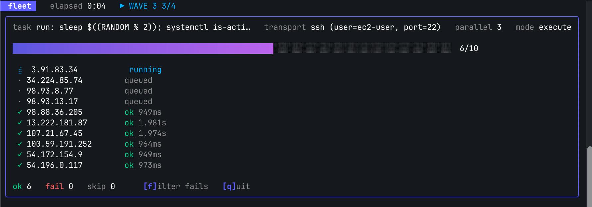
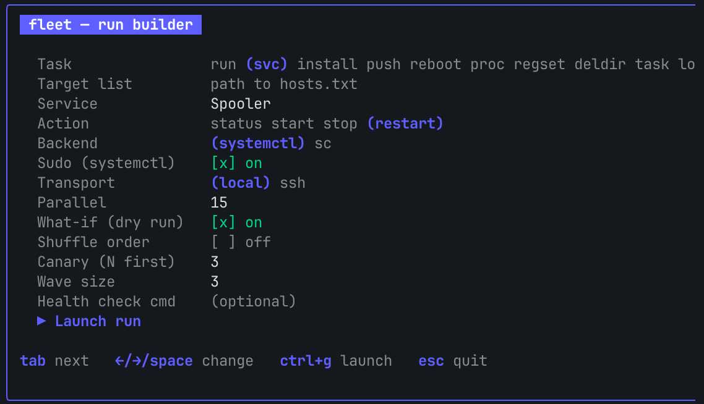
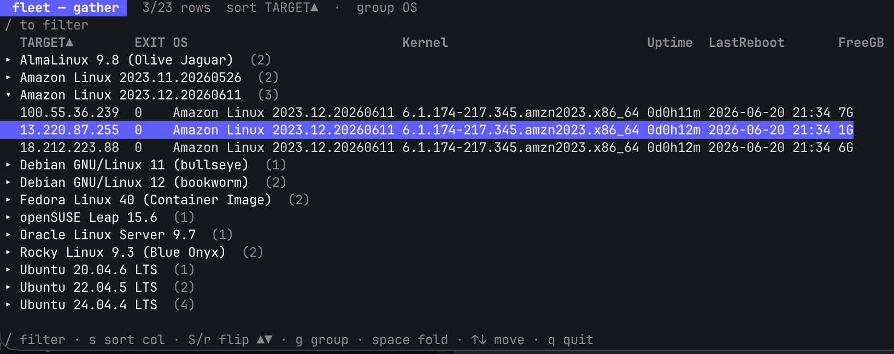
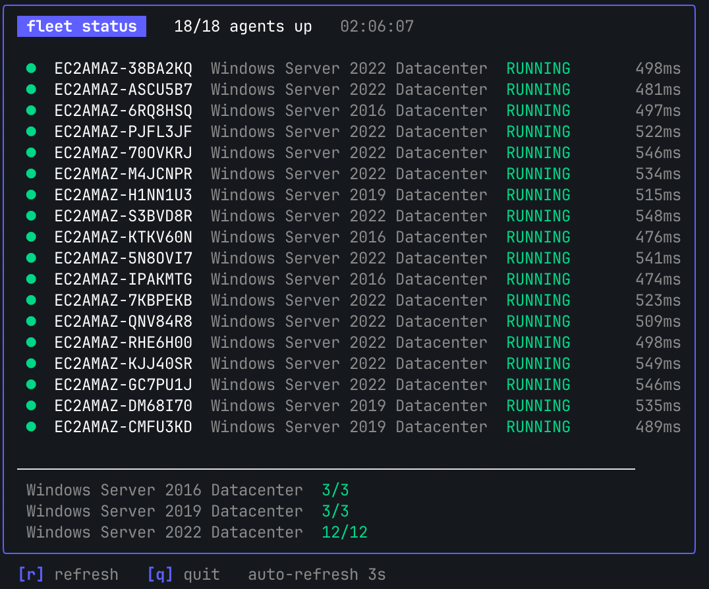
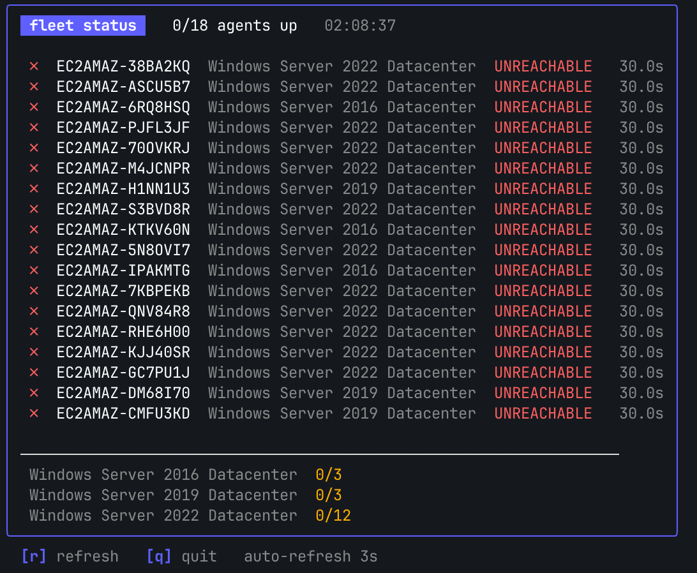

# winadmin / `fleet`

**A parallel fleet-automation tool for sysadmins — inspired by the classic overnight fleet-runners of the early-2000s
Windows admin era, rebuilt in Go.** Point it at a list of machines and a task; it fans out across them with a
bounded worker pool, a dry-run, staged rollouts, a live TUI, and a structured audit trail.

It started as a translation exercise — porting the "common things" out of a turn-of-the-
millennium Windows desktop-automation toolkit (registry edits, AD/NT group gating,
run-as-with-password) into idiomatic Go. It grew into a real tool. The original overnight
"run this batch file against 350 backup DCs" job — now with brakes and a paper trail.



<sup>A staged rollout (canary → waves) running across a real 10-machine fleet over SSH — live, in the terminal.</sup>

📖 Start with the **[WinBatch → Go primer](docs/winbatch-to-go-primer.md)** for the origin story.

---

## Quick start

```sh
go install ./cmd/fleet        # puts `fleet` on your PATH
# (or: go build -o bin/fleet ./cmd/fleet  — note: -o fleet collides with the fleet/ pkg dir)

fleet tui                       # the fastest way to see it: the interactive TUI
fleet run -L hosts.txt -P 15 -c "uptime"   # or straight from flags
```

`hosts.txt` is one machine per line (`#`/`;` comments ok) — or skip the file entirely and let
a query define the fleet (see [Inventory](#inventory)).

---

## What it can do

### Verbs

| Verb | Does | Example |
|---|---|---|
| `run` | run any command (templated with `{{.Name}}`) | `run -c 'ping -n 1 {{.Name}}'` |
| `svc` | start/stop/restart/status a service | `svc --name nginx --action restart --sudo` |
| `install` | silent install MSI / EXE / script | `install --package '\\dist\App.msi' --args ALLUSERS=1` |
| `push` | copy files to each box | `push --src '\\dist\app' --dst 'C$\App' --mirror` |
| `reboot` | reboot (guarded by `--yes`) | `reboot --backend win --delay 60 --yes` |
| `proc` | kill a process | `proc --image stuck.exe --force` |
| `task` | manage a scheduled task | `task --name Nightly --action run` |
| `localgroup` | add/remove a local-group member | `localgroup --member 'CORP\jdoe'` |
| `firewall` | add/delete a firewall rule | `firewall --name 'Block SMB' --port 445 --fw-action block` |
| `regset` | set a registry value | `regset --hive HKLM --key 'Software\X' --name On --data 1` |
| `deldir` | delete a directory | `deldir --path 'C$\Temp\junk'` |
| `ldapset` | set an attribute on every user in an AD/LDAP OU | `ldapset --base 'OU=Tellers,…' --attr department --value Retail` |
| `gather` | run a query per box, tabulate it (or `--query` a canned one) | `gather --query 'free disk (linux)' --tui` |
| `agent` | the pull side: each box fetches + runs its own job | `agent --source \\share\job.txt --interval 60s` |
| `provision` | install the agent as a service across a fleet + register them | `provision -L hosts.txt --transport winrm --agent-url … --job-source …` |
| `status` | poll the registered fleet's agent service — a live dashboard | `status --tui --registry fleet-registry.json` |

### Transports (`--transport`)

| | Reaches the box via | Use when |
|---|---|---|
| `local` *(default)* | the command itself — `sc \\host`, `reg \\host`, `robocopy \\host` (RPC/SMB) | classic Windows remote-admin from one control box |
| `ssh` | SSH (key / agent / password) | cross-platform; Linux, or Windows OpenSSH |
| `winrm` | WS-Man / PowerShell Remoting | the native Windows path, no SSH needed |
| `psexec` | SysInternals PsExec over SMB | boxes with neither SSH nor WinRM |
| `wmi` | `wmic /node:` (fire-and-forget) | kicking off work where you don't need output |

### Inventory

The fleet is whatever you point it at — a static file *or* a live query:

```sh
-L hosts.txt                                   # a file
--inventory-cmd 'aws ec2 describe-... | ...'   # any command's stdout (one target per line)
--inventory aws:'Name=tag:env,Values=prod'     # plugin: cloud query
--inventory ad-ou:'OU=Tellers,DC=corp,DC=com'  # plugin: every user in an OU (uses LDAP_* env)
--inventory ad-group:'CN=Admins,…'             # plugin: every member of a group
```

### Batch a script over a list — of *anything*

The list isn't only machines. Put **folders, usernames, files** in it and run a
script (or a verb) per item — the oldest fleet-runner move, with brakes:

```sh
# run a local script once per item; the item arrives as $1 (a whitespace row → $1 $2 $3)
fleet run -L folders.txt --script ./rename-stuff.sh --what-if

# name the columns of each row and template them into ANY verb
fleet localgroup -L users.csv --csv --cols user,group \
  --member '{{.user}}' --group '{{.group}}' --action add --what-if
```

Columns are `{{.F1}}`, `{{.F2}}`, … (split on whitespace by default; `--csv`/`--delim`
to change it), or named with `--cols`; the whole row is always `{{.Name}}`. See
[`examples/batch-script`](examples/batch-script/).

### Safety — what makes it *good*, not just powerful

- **`--what-if`** — render every command without running anything.
- **`--match 'web*,db0?'`** keeps only matching targets; **`--preview`** prints the resolved
  target list and exits — see exactly who you're about to hit before you fire.
- **Staged rollout** — `--canary 1 --wave 25 --health-cmd ./probe.sh`: hit one box, health-check,
  *then* let it ripple in waves; a failed gate aborts and skips the rest.
- **Lifecycle** — `--loop N` (`0` = forever), `--wait 30s` / `--start-at 02:00` to schedule the
  start, and `--pre`/`--post '<cmd>'` to bracket the fan-out with a control-host command. The
  live TUI shows the countdown, pre/post steps, and a loop counter.
- **`--retries` / `--retry-backoff`**, **`--timeout`**, **`--stop-on-error`**.
- **Confirm-on-blast** — destructive verbs refuse >1 target without `--yes`.
- **`--export results.json|.csv`** — the artifact you staple to the change ticket.
- A structured **`slog` audit trail** on stderr — who/target/command/result/duration.

---

## The TUI

```sh
fleet tui                              # interactive run builder → live dashboard
fleet run -L hosts.txt -c '…' --tui    # any verb + --tui jumps straight to the dashboard
fleet gather -L hosts.txt -c '…' --tui # a filterable results table
```

The **run builder** speaks every verb (fields change with the task — here, `svc`, with
type-ahead over Windows service short/display names), plus transport, staged-rollout, and
lifecycle (loop/wait/pre-post) options. `ctrl+o` browses for any path field, `ctrl+p` previews
the resolved targets, `ctrl+e` opens **settings**, and `ctrl+g` launches.

**Settings** (`ctrl+e`) persist your defaults — parallelism, transport, SSH user/key, the
services list, a default target list — to a config file (`~/.config/fleet/config.json`, or
`$FLEET_CONFIG`). The file is the source of truth: it seeds both the run builder *and* the
CLI's flag defaults, and an explicit flag still wins.



It hands off to a **live "btop-style" dashboard** (the hero shot above) — per-target spinners,
a progress bar, running→fail→queued→done ordering, canary/wave markers, and ok/fail/skip
counts. And `gather --tui` turns the fleet into a **spreadsheet** — it parses each box's output
into real columns, then lets you **sort by any column** (numeric-aware), **group into an
expandable tree** by any column (including an `OS` column joined from the registry), and
`/`-filter across all cells:



<sup>A real 23-box, multi-distro fleet (Ubuntu · Debian · Rocky · Alma · Fedora · openSUSE · Oracle ·
Amazon Linux) gathered over SSH and grouped by OS — uptime, last reboot, and free disk per box,
live in the terminal.</sup>

---

## Provisioning & the live status board

Point `fleet` at a list of machines and it'll **provision** them — push the agent, install it as a
real Windows service (`sc create`, SCM-aware), and **register** each box in a file-based registry
(a JSON file; put it on a network share and the whole team's `fleet status` sees the same fleet —
no server, no database):

```sh
fleet provision -L hosts.txt --transport winrm --winrm-user Administrator \
  --agent-url https://dist/fleet.exe --job-source https://dist/job.txt --registry fleet.json
```

Then **`fleet status --tui`** is the live heartbeat board: it polls the agent service on every
registered box on a cycle, with each machine's own hostname + OS, per-box response **latency**
(a laggy box stands out), and a per-OS roll-up. Problems sort to the top, btop-style.



…and the view you never want to see — connectivity lost, the whole fleet gone red:



<sup>Both shots are real: an 18-node mixed Windows fleet (Server 2016/2019/2022) provisioned and
polled over WinRM from a Linux control host — see the [live-fire writeup](docs/live-fire-provisioning-2026-06-20.md).</sup>

---

## The library

`fleet` is a thin CLI over reusable packages — build your own admin tools on these:

| Package | Does |
|---|---|
| `fleet`  | the engine: inventory (`ResolveInventory` plugins: file/cmd/aws/ad-ou/ad-group), bounded worker pool, staged rollout, transports, verb tasks, agent pull-model, slog audit, and the reporting side (`ExportResults` JSON/CSV, `FormatGather`) |
| `secret` | `CredentialProvider` interface — plaintext / env / DPAPI / Windows Credential Manager. Secure by default; plaintext must be asked for by name |
| `reg`    | WOW64-aware registry read/write — strings, DWORDs, multi-strings, value/key existence |
| `osinfo` | typed OS identification from the registry — product/edition/build/arch, workstation vs server vs DC, RDS-host detection, all in one `Info` |
| `groups` | group membership — current-user via the access token (no DC round-trip), token-group enumeration, and a leaf-name `InGroupList` predicate for gating on an externally-fetched (e.g. computer-object) list |
| `runas`  | run a command as another user (`CreateProcessWithLogonW`) |
| `acl`    | grant/revoke NTFS permissions via `icacls` |
| `reboot` | schedule replace/delete of in-use files at next boot (`MoveFileEx`), and detect whether a reboot is already pending |
| `dialog` | pure-ASCII homage to the chunky retro Windows message boxes — `Render()`/`Message`/`Warn`/`AskYesNo`. Cross-platform, zero deps, mostly for kicks |

---

## Proven, not just compiled

Every feature gets a **live-fire** pass against throwaway cloud/container labs, not just unit
tests — that's how the SSH-auth, `--ssh-port`, `-v`, and dynamic-inventory gaps were caught:

- **[SSH / LDAP](docs/live-fire-2026-06-18.md)** — 10× EC2 over real internet SSH; an AD
  attribute set across an OU (OpenLDAP).
- **[Verbs + staged rollout](docs/live-fire-verbs-2026-06-18.md)** — 6× EC2, healthy
  canary→waves *and* a health-gate abort.
- **[Windows transports](docs/live-fire-windows-2026-06-19.md)** — Server 2022 EC2: WinRM
  doing real registry read/write + service restart, WMI, PsExec — all driven from Linux.
- **[Provisioning + status board](docs/live-fire-provisioning-2026-06-20.md)** — an 18-node
  mixed Windows fleet (Server 2016/2019/2022) provisioned to a running service and polled live
  over WinRM; two real bugs the live-fire caught and a clean teardown to $0.
- **[gather spreadsheet](docs/live-fire-gather-2026-06-20.md)** — sort/group/columns proven on
  an 8-box mixed-Linux lab and a **4-version Windows fleet (Server 2016/2019/2022/2025)**; the
  fleet caught that **`wmic` is gone on Server 2025** (the canned queries moved to PowerShell/CIM).

Full backlog status: **[ROADMAP.md](docs/ROADMAP.md)**.

## Build & CI

Builds, vets, and tests on macOS/Linux and cross-compiles clean to `windows/amd64`. The
Win32-backed code (`reg`, `runas`, `groups`, registry) is behind `//go:build windows` with
non-Windows stubs. CI runs gofmt / vet / test / `govulncheck` on every push, **executes the
Windows-tagged tests on a `windows-latest` runner**, and on tag cuts cross-platform release
binaries with a **CycloneDX SBOM**, **SHA256SUMS**, a keyless **cosign** signature, and
**SLSA build provenance**.

## License

MIT — see [LICENSE](LICENSE).
